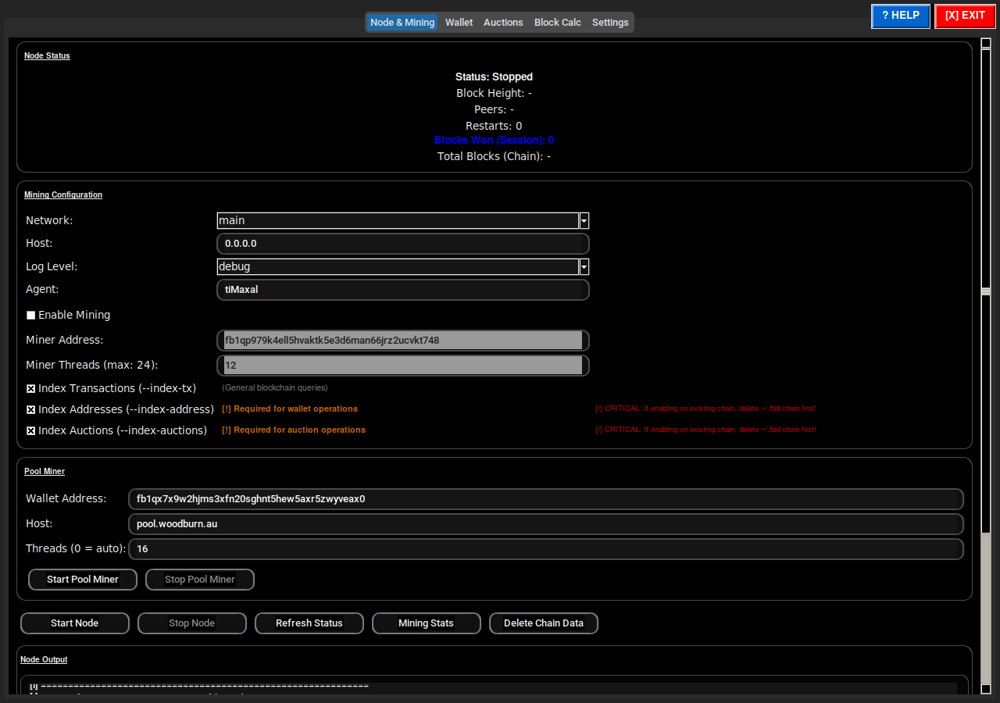
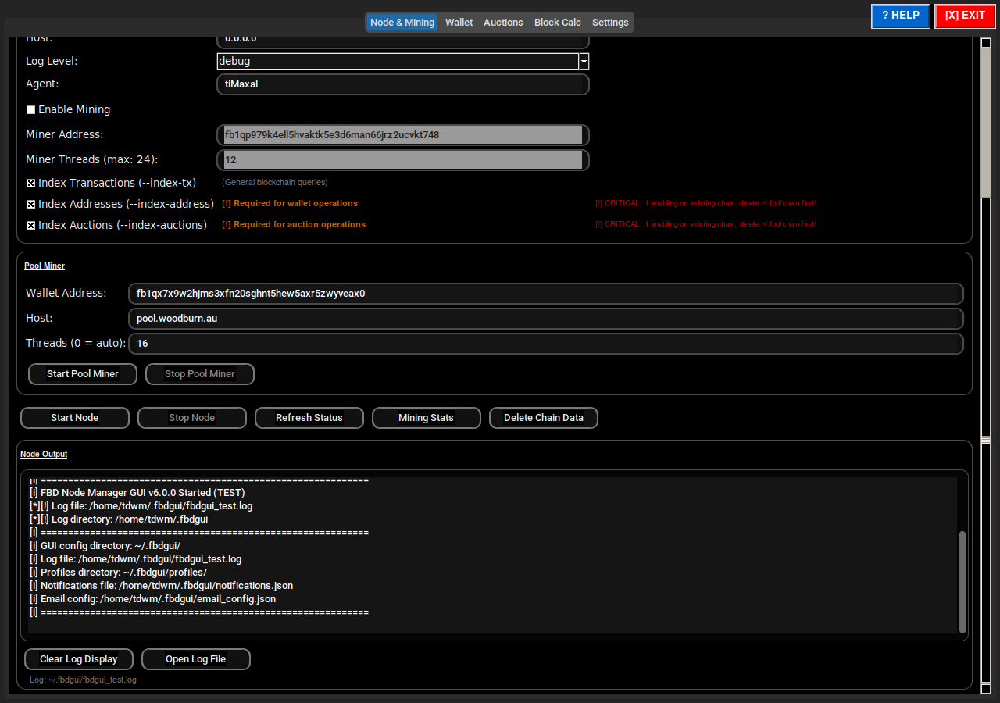
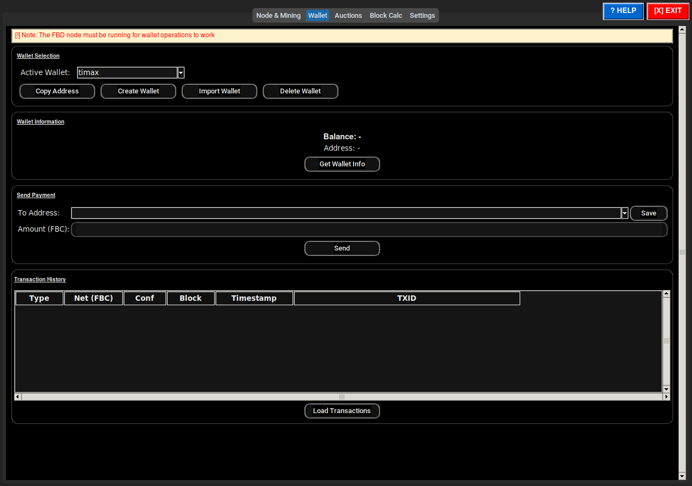
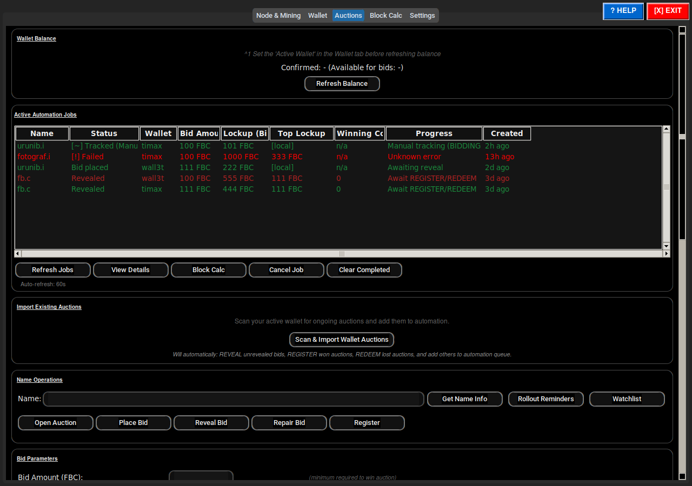
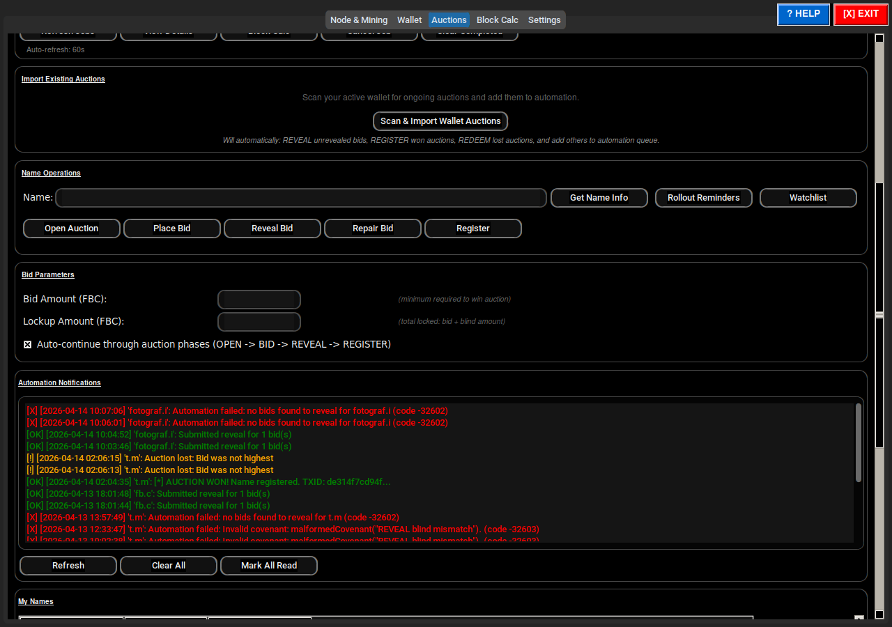
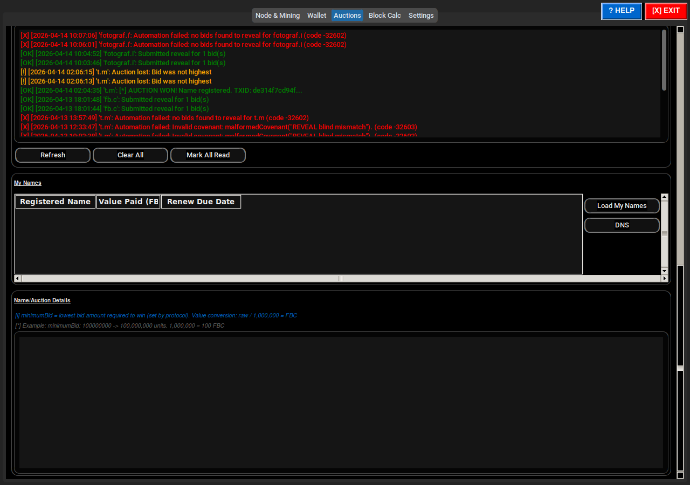
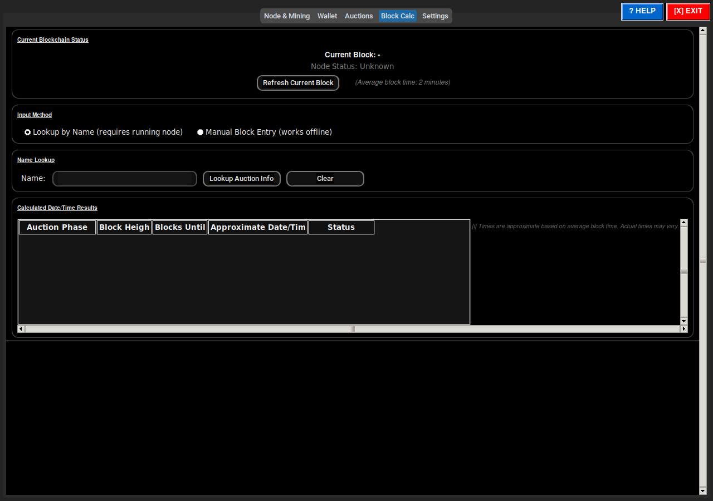
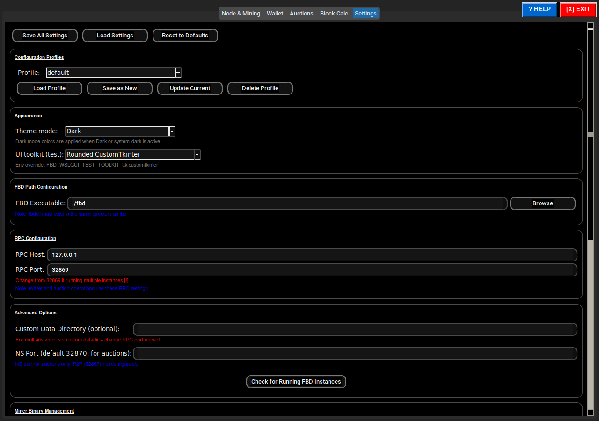
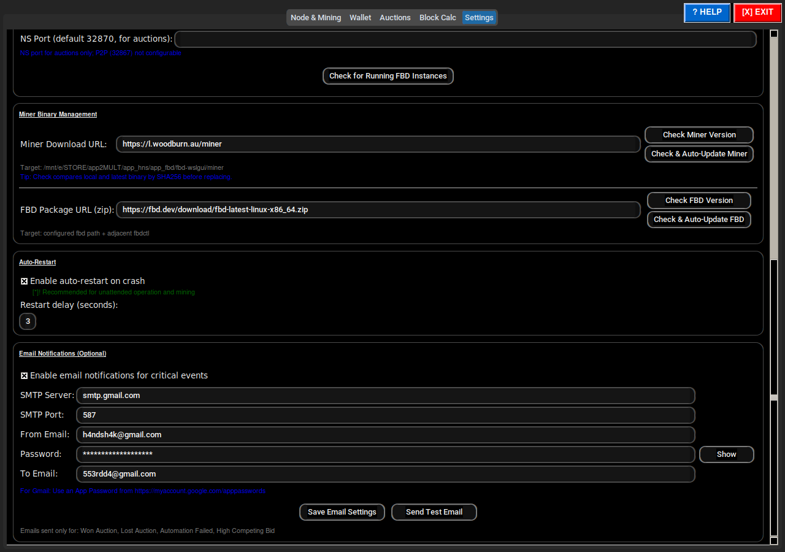

# FBD Node Manager — UI Documentation

_Auto-generated by fbdwslgui_docmode_capture.sh_

## 01 Node Mining Top

## 01 Node Mining Bottom

## 02 Wallet

## 03 Auctions Top

## 03 Auctions Middle

## 03 Auctions Bottom

## 04 Block Calc

## 05 Settings Top

## 05 Settings Bottom

